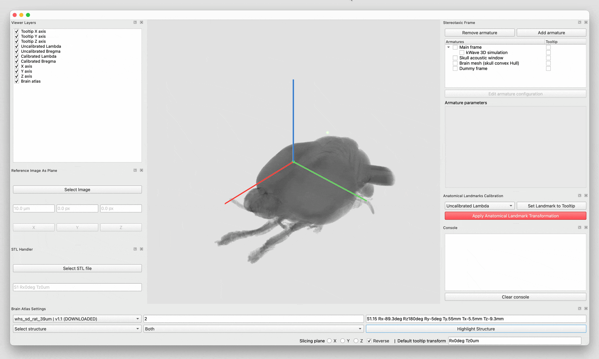
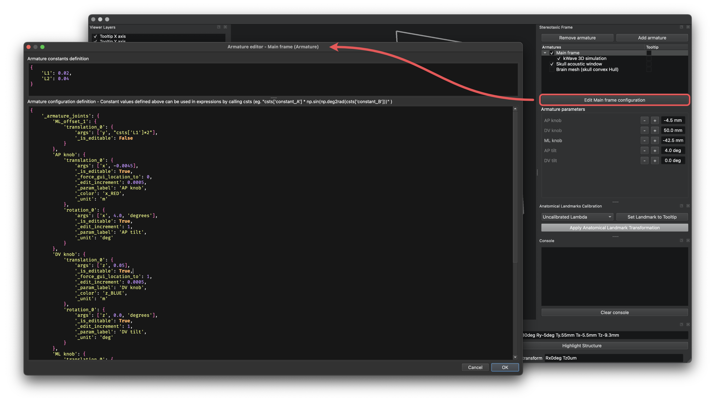
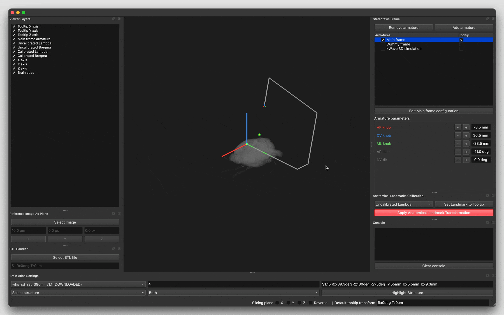
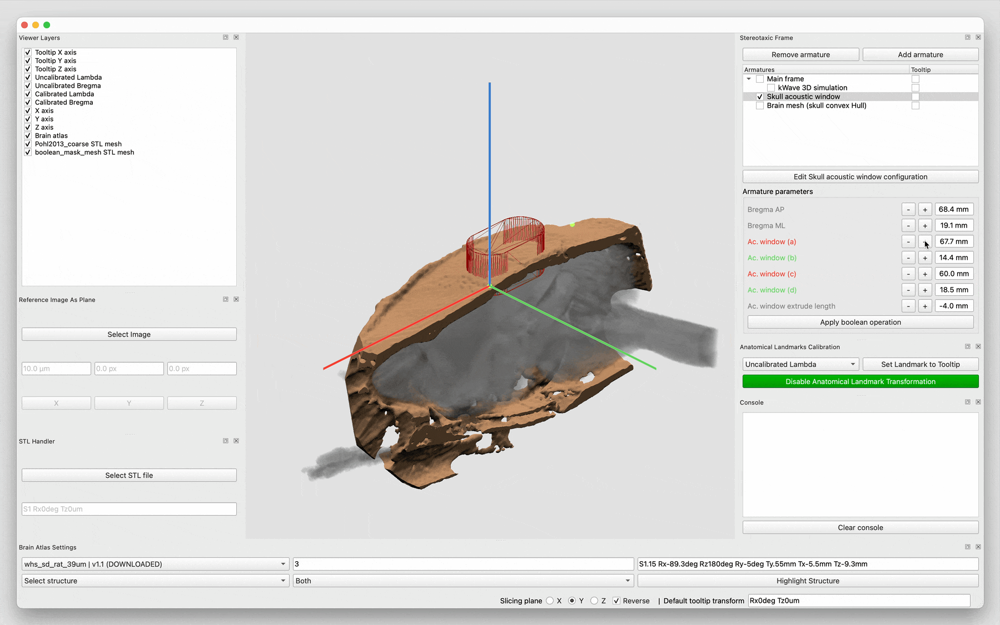
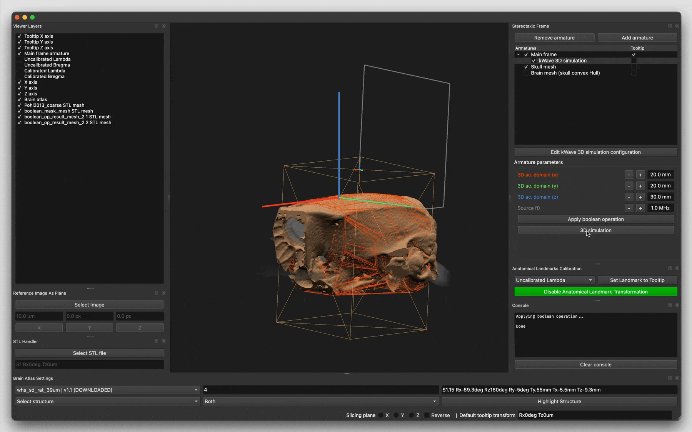

# CoperniFUS

## Key features

### BrainGlobe + Structure highlighting
Supports a large range of Brain Atlases and associated structures thanks to [BrainGlobe Atlas API](https://brainglobe.info/documentation/brainglobe-atlasapi/index.html).

### Stereotaxic frame module - Armature inheritance
Arbitrary stereotaxic frames can be easily simulated using a flexible dictionary-based editor.

Stereotaxic frame elements (referred as armatures) can be associated in a hierarchical tree structure allowing to perform operations such as mesh boolean operation or acoustic simulations in any spatial reference frame.

### Anatomical calibration module
Atlases scale and orientation can be simply matched to experimental conditions using anatomical landmarks such as Lambda and Bregma for rodents.

### Trimesh boolean operations
Integration with the Python library [trimesh](https://trimesh.org) allow for the manipulation of meshes. This feature greatly simplifies the execution of acoustic simulations in the presence of skulls.

### k-Wave acoustic simulation
Support axisymmetric simulations in homogeneous domains and 3D simulations in complex mediums.

## Getting started
Tested on macOS 15, Windows 10 & 11 using Python 3.12.

### Installation
1. Make sure [Blender 4.1](https://download.blender.org/release/Blender4.1/) is installed on your system. It will be used by [trimesh](https://trimesh.org) to perform boolean operations.
2. Optional but highly recommended: setup a dedicated Python 3.12 environment
    - Using `conda`: `conda create -n coperniFUS_env python=3.12`
    - Activate the newly created environment using `conda activate coperniFUS_env`
3. Install `coperniFUS` using `pip`
    - `pip install git+https://github.com/Tomaubier/CoperniFUS.git`
4. Launch `coperniFUS` by running `coperniFUS` in a terminal.

## Related projects
- [BrainCoordinator](https://github.com/simonarvin/braincoordinator)
- [BrainCoord](https://github.com/RicardoRios46/BrainCoord)
- [VVASP](https://github.com/spkware/vvasp)