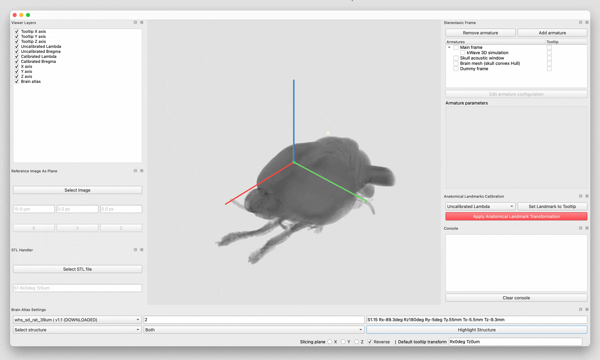
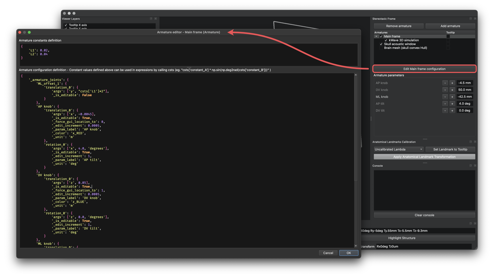
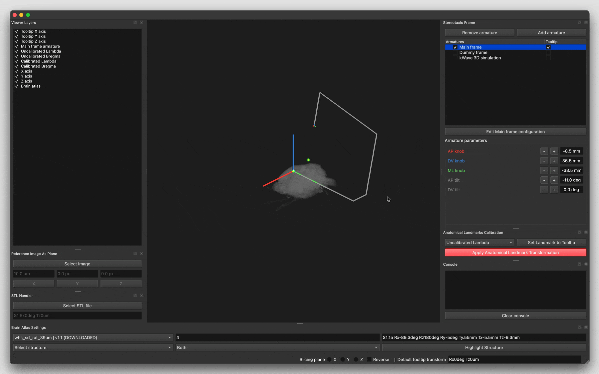
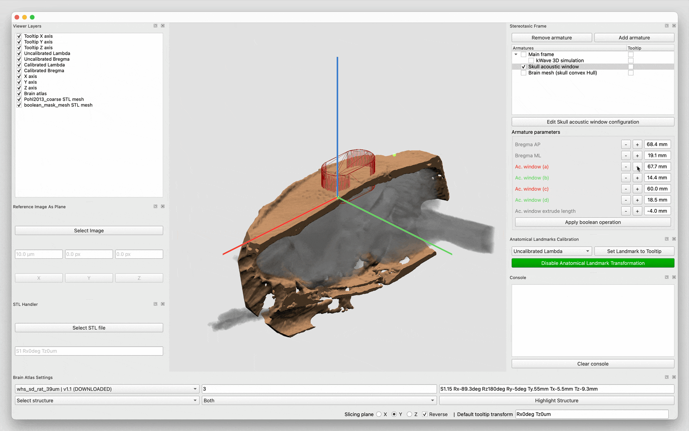
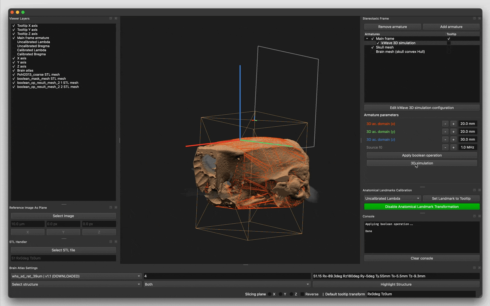

# CoperniFUS: A flexible Python-based GUI for stereotaxic Focused UltraSound (FUS) experiment planning

 

In the quest for a better control and understanding of the mechanisms of ultrasound neuromodulation and neurostimulation, the planning of experiments, evaluation of acoustic parameters via simulations, and post-processing of results often rely on distinct software programs with their own coordinate systems, which greatly complicates the integration, analysis, and interpretation of key information.
Designed around a unified coordinate system architecture, `CoperniFUS` is built to address this challenge by offering a versatile software platform for planning stereotaxic FUS procedures.

Check out the [Documentation](https://copernifus.readthedocs.io/en/latest/) and [step by step tutorial](https://copernifus.readthedocs.io/en/latest/contents/tutorial.html#) to learn more on its usage.

> [!IMPORTANT]  
> Like any other numerical modeling technique, the quality of the results produced by CoperniFUS depends entirely on the choice of input parameters. This software, developed in the context of my PhD, is also subject to bugs. It is therefore of the responsibility of the user to design and perform careful assessments of the results validity. If you identify any significant issues, please document them [in GitHub's issue section](https://github.com/Tomaubier/CoperniFUS/issues).

## Key features

### BrainGlobe + Structure highlighting
Supports a large range of Brain Atlases and associated structures thanks to [BrainGlobe Atlas API](https://brainglobe.info/documentation/brainglobe-atlasapi/index.html).

### Stereotaxic frame module - Armature inheritance
Arbitrary stereotaxic frames can be easily simulated using a flexible dictionary-based editor.

Stereotaxic frame elements (referred as armatures) can be associated in a hierarchical tree structure allowing to perform operations such as mesh boolean operation or acoustic simulations in any spatial reference frame.

### Anatomical calibration module
Atlases scale and orientation can be simply matched to experimental conditions using anatomical landmarks such as Lambda and Bregma for rodents.

### Trimesh boolean operations
Integration with the Python library [trimesh](https://trimesh.org) allow for the manipulation of meshes. This feature greatly simplifies the execution of acoustic simulations in the presence of skulls.

### k-Wave acoustic simulation
Support axisymmetric simulations in homogeneous domains and 3D simulations in complex mediums.

## Getting started
Tested on macOS 15, Ubuntu 24.04.2 LTS, Linux Mint 21.1, Windows 10 & 11 using Python 3.12.

### Installation
For detailed instructions and troubleshooting steps [checkout the documentation here](https://copernifus.readthedocs.io/en/latest/index.html).

0. Optional but highly recommended: setup a dedicated Python 3.12 environment (I recommended using [miniconda](https://docs.anaconda.com/miniconda/install/))
    - Using `conda`: `conda create -n coperniFUS_env python=3.12`
    - Activate the newly created environment using `conda activate coperniFUS_env`

1. Install `coperniFUS` using `pip` (if you are using windows, you might need to install Git)
    - `pip install git+https://github.com/Tomaubier/CoperniFUS.git`

        > 1a. *For Linux users:* Install `libxcb-cursor-dev` to satisfy `PyQt6` requirements `sudo apt-get install -y libxcb-cursor-dev` [see](https://stackoverflow.com/questions/77725761/from-6-5-0-xcb-cursor0-or-libxcb-cursor0-is-needed-to-load-the-qt-xcb-platform) for additional details.

        > 1b. *For macOS users:* `k-wave-python` currently requiers `fftw hdf5 zlib libomp` to be installed. This requirement con be satisfied by running `brew install fftw hdf5 zlib libomp` using [Homebrew](https://docs.brew.sh/Installation). [See this k-wave-python issue](https://github.com/waltsims/k-wave-python/issues/549) for additional details.

2. Launch CoperniFUS by running `coperniFUS` in a terminal. Checkout [this page](https://copernifus.readthedocs.io/en/latest/contents/usage.html) for detailed usage instructions.

## Contributing to the project
With the aim of making CoperniFUS suitable for a wide range of applications, your feedback and contributions are always welcome! Please refer to the [Contribution Guidelines](CONTRIBUTING.md) if you wish to do so.

## Related projects
- [BrainCoordinator](https://github.com/simonarvin/braincoordinator)
- [BrainCoord](https://github.com/RicardoRios46/BrainCoord)
- [VVASP](https://github.com/spkware/vvasp)
- [Kranion](https://www.fusfoundation.org/for-researchers-and-clinicians/resources/kranion/)
