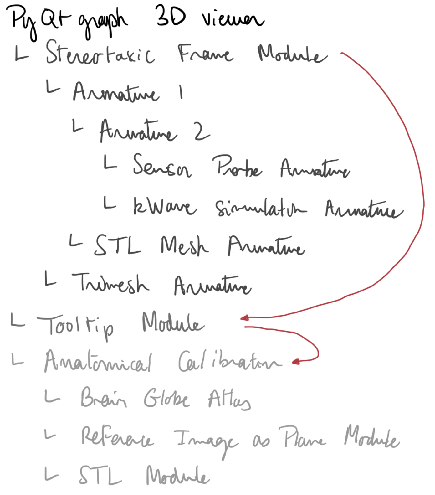

# Summary

Focused UltraSound (FUS) is gaining increasing interest for its potential as a minimally-invasive yet targeted alternative to existing neurostimulation modalities.
% relying on highly diffuse electrical or magnetic fields to affect the activity of neural structures.
Although reversible changes in the neural activity of structures have been reported as far back as 1928 [@Harvey1928], comprehensive descriptions of the short- and long-term effects of ultrasound on neural structures are still laking to achieved neurostimulation with satisfactory levels of control and safety. Delivering well characterized FUS pulses with a high degree of spatial selectivity along with local assessment of the state and activity of specific brain regions is crucial in pursuing this research.
Unlike most electrophysiology procedures involving compact needle-like probes that can be achieved using stereotaxic frame limited to three degrees of freedom, FUS experiments on small *in vivo* models often require the implementation of complex probe layouts to assess the activity of the stimulated neural structures.
Treatment planning, evaluation of acoustic parameters through simulations, and post-precessing of results often rely on distinct softwares with their own coordinate systems which greatly complicates the detailed characterization of the spatial and temporal effects of FUS stimulations.
`CoperniFUS` aims to overcome this obstacle by providing a flexible software platform to plan procedures on stereotaxic frames thanks to a unified coordinate system architecture, which additionally allows for the management of anatomical variability based on the registration of anatomical landmark.

# Statement of need

<!-- % Relevance of studies on FUS-induces microenvironment alteration -->
In an effort to assess the therapeutic potential of ultrasound neurostimulation, studies have been attempted to characterize the effect of ultrasound on the biochemical micro-environment of brain structures after stimulations. While tools like Magnetic Resonance Spectroscopy (MRS) offer a non-invasive way of assessing the concentrations of metabolites *in vivo*, they come with significant limitations. Concentration evaluation are non-specific, only representative of the total amount metabolic, extra- and intra-cellular quantity of a compound [@Dyke2017]. The spatial selectivity of the method is also limited to minimum voxel volumes of several $cm^3$. Finally, the difficulties arising from the integration of FUS transducers in MRIs are holding back the investigation of *online* effects [@Yaakub2023].

<!-- % FUS targetting -->
Studies on rodent models have been pursued using invasive methods such as microdialysis [@Min2011; @Yang2012]. Although these studies report effects of FUS stimulations on Dopamine, Serotonin or GABA levels, their observations are restricted to low ultrasound central frequencies resulting in poorly spatially-selective stimulation, which complicates the assessment of region-specific responses. The choice of low frequencies is typically done to maximize energy transfer through the skull and minimize pressure field distortions. Transducer placement and targeting of the structure is empirical, based on trigonometric evaluation of the focus relative to reference atlases.

<!-- % acoustic simulations -->
With the growing interest in transcranial ultrasound therapeutic approaches, extensive research has been conducted to develop and validate computational models of acoustic wave propagation through the skull. Although a number of tools and formalisms exist [@Aubry2022a], k-Wave [@Treeby2010] has been widely adopted in the field of ultrasound neurostimulation specifically [@Constans2018; @Verhagen2019; @Yaakub2023]. Acoustic simulations in this context are performed using standalone Matlab scripts for the definition of acoustic sources and domains. Acoustic domains are defined either directly based on CT or pseudo-CT scans [@Aubry2003], or by constructing maps from rasterized brain and skull meshes. Registration of the transducer location relative to targeted brain structures is achieved using optical tracking systems on human or non-human primate subjects, however empirical methods are usually chosen in small rodents experiments due to the space constraints associated with these models.

<!-- % structure atlases + morpho calib -->
Targeting of brain structures is achieved using reference atlases registered to MRI scans of subjects when available. However for small animals, these are typically not performed in a systematic way. Targeted structures coordinates are thus directly evaluated on reference atlases, based on anatomical landmarks such as the Bregma skull suture on rats and mice [@Kleven2023; @Wang2020]. Morphological variability between subjects can compromise experiments if it is not taken into account however registration of reference atlases to anatomical measurements can be tedious and is rarely reported in rodent studies.

# Features

# Figures

Figures can be included like this:

and referenced from text using \autoref{fig:example}.

Figure sizes can be customized by adding an optional second parameter:
{width=20%}

# Acknowledgements

This project was supported by the French National Research Agency (ANR-16-TERC0017, ANR-21-CE19-0007 \& ANR-21-CE19-0030), the American Focused Ultrasound Foundation (LabTAU, FUSF Center of Excellence). Additionally, this work was performed within the framework of the LABEX DEV WECAN (ANR-10-LABX-0061) and CORTEX (ANR-11-LABX-0042) of Université de Lyon, within the program "Investissements d'Avenir" (ANR-11-IDEX-0007) operated by the French National Research Agency (ANR). The work of the communities behind k-Wave and the Python packages used throughout this work was integral to its completion.

# References